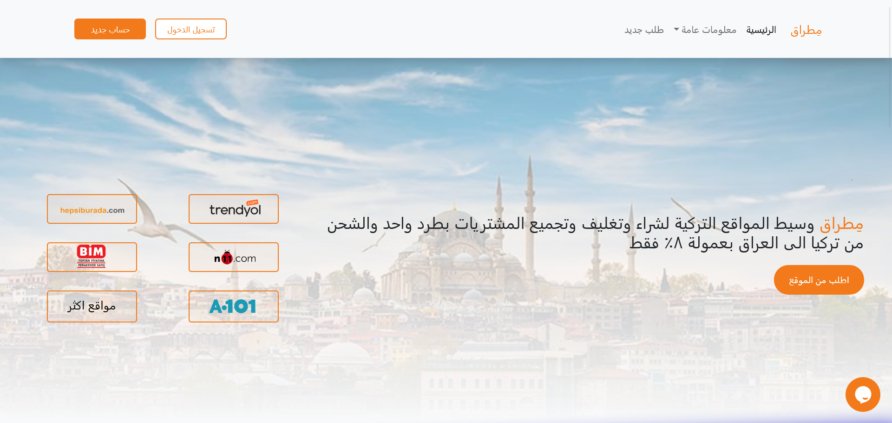

<br/>
<p align="center">
  <a href="https://github.com/0Rawan/metrak">
    
  </a>

  <h3 align="center">Metrak</h3>

  <p align="center">
    Welcome to our MERN stack-powered web service project! We've built a feature-rich web application that caters to our customers' needs using the modern and robust MERN stack. Here's a brief overview of what we've accomplished:
    <br/>
    <br/>
    <a href="https://github.com/0Rawan/metrak"><strong>Explore the docs »</strong></a>
    <br/>
    <br/>
    <a href="https://github.com/0Rawan/metrak">View Demo</a>
    .
    <a href="https://github.com/0Rawan/metrak/issues">Report Bug</a>
    .
    <a href="https://github.com/0Rawan/metrak/issues">Request Feature</a>
  </p>
</p>

   

## Table Of Contents

* [About the Project](#about-the-project)
* [Built With](#built-with)
* [Getting Started](#getting-started)
* [Roadmap](#roadmap)
* [Contributing](#contributing)
* [License](#license)
* [Authors](#authors)
* [Acknowledgements](#acknowledgements)

## About The Project




## Technologies Used:
- **Front-end Framework:** React.js
- **Back-end Server:** Express.js
- **Database:** MongoDB
- **Payment Gateway:** PayPal
- **Deployment Platforms:** Heroku (Express.js Server), Netlify (React.js)

## Key Highlights:

### 1. User-Friendly UI Design
We've meticulously designed the user interface to provide an exceptional user experience. From selecting an appealing color scheme to incorporating eye-catching SVG animations, we've focused on enhancing the visual appeal of the website.

### 2. Efficient Database Management
We've harnessed the power of MongoDB for efficient data storage. Our team designed and implemented well-structured queries to ensure smooth interactions with the database, making data retrieval and manipulation seamless.

### 3. Secure Payment Processing
To facilitate seamless transactions, we integrated the trusted PayPal payment gateway. This ensures a secure and convenient payment experience for our users.

### 4. Scalable Deployment
We've taken care of deployment as well. Our Express.js server is hosted on Heroku, while our React.js front-end is deployed on Netlify. We've established a smooth communication channel between the two, allowing data to flow seamlessly between the front-end and back-end, ensuring a fast and reliable user experience.

## Project Goals:
Our goal was to create a modern, efficient, and visually appealing web service that caters to our customer's needs while also showcasing our skills with the MERN stack. We believe we've achieved this by designing an attractive UI, optimizing database interactions, and ensuring secure payment processing.

## How to Get Started:
If you'd like to explore our project further or contribute, follow these steps:

1. Clone the repository to your local machine.
2. Set up the necessary environment variables for MongoDB and PayPal.
3. Run the Express.js server on Heroku.
4. Deploy the React.js front-end on Netlify.
5. Start exploring and enhancing the project!

Feel free to reach out to us for any questions, feedback, or collaboration opportunities. We're excited to see how our MERN stack web service can evolve with your support!

## Built With

Built With

**1. Front-end : We chose React.js as our front-end framework, allowing us to build a responsive and engaging user interface. The design not only adheres to industry standards but also includes captivating SVG animations to enhance the overall user experience.

**2. Back-end: The Express.js back-end serves as our API server, handling data processing and ensuring smooth communication between the front-end and the database. Our queries are meticulously designed to make database interactions efficient and error-free.

**3. Robust Database: MongoDB serves as the backbone of our data storage system. It not only handles customer data but also stores essential information required for the payment processing system to work seamlessly.

**4. Secure Payments: We integrated the trusted PayPal payment gateway, ensuring that transactions are secure and hassle-free for our users. This feature adds a layer of convenience and trust to our web service.

**5. Scalable Deployment: To ensure reliability and scalability, we deployed our Express.js server on Heroku and the React.js front-end on Netlify. This setup allows us to efficiently serve and communicate with our users, no matter where they are located

## Getting Started

# Getting Started

We're thrilled that you're interested in getting started with our MERN stack web service project! Whether you're a developer eager to contribute or someone looking to explore our service, this guide will help you take the first steps.

## Prerequisites

Before you begin, please ensure you have the following prerequisites installed on your system:

1. **Node.js:** You can download and install Node.js from the official website: [Node.js Downloads](https://nodejs.org/).

2. **Git:** If you don't have Git installed, you can download it from: [Git Downloads](https://git-scm.com/downloads).

3. **MongoDB:** Install MongoDB locally or set up a remote MongoDB instance. You can find installation instructions for various platforms on the [MongoDB Documentation](https://docs.mongodb.com/manual/installation/) page.

## Clone the Repository

To get the project's source code on your local machine, follow these steps:

1. Open your terminal or command prompt.

2. Navigate to the directory where you want to store the project:

   ```bash
   cd your/chosen/directory
   ```

3. Clone the repository using Git:

   ```bash
   git clone https://github.com/0Rawan/metrak.git
   ```

## Setting Up Environment Variables

Our project relies on environment variables for sensitive information such as API keys, database URLs, and more. Here's how you can set them up:

1. Inside the project directory, you'll find a `.env.example` file. Duplicate this file and rename the copy to `.env`.

2. Open the `.env` file and replace the placeholders with your own values. For example:

   ```env
   MONGODB_URI=your-mongodb-connection-uri
   PAYPAL_CLIENT_ID=your-paypal-client-id
   ```

   Make sure to fill in the correct values for your environment.

## Running the Application

Now that you have the project cloned and environment variables set up, you can run the application:

1. Install the project's dependencies by navigating to the project directory in your terminal and running:

   ```bash
   npm install
   ```

2. Start the Express.js server:

   ```bash
   npm start
   ```

3. Open another terminal window, navigate to the project's `client` directory:

   ```bash
   cd client
   ```

4. Install the client's dependencies:

   ```bash
   npm install
   ```

5. Start the React.js development server:

   ```bash
   npm start
   ```

The application should now be up and running locally. You can access it in your web browser at `http://localhost:3000`. The Express.js server should be running at `http://localhost:5000`.

## Explore and Contribute

You're all set to explore our web service! Feel free to explore the website and test its functionality. If you're a developer interested in contributing, don't hesitate to reach out to us or create pull requests with your enhancements and bug fixes.

Thank you for joining us on this exciting journey with our MERN stack web service project. Happy coding!

## Roadmap

See the [open issues](https://github.com/0Rawan/metrak/issues) for a list of proposed features (and known issues).

## Contributing

Contributions are what make the open source community such an amazing place to be learn, inspire, and create. Any contributions you make are **greatly appreciated**.
* If you have suggestions for adding or removing projects, feel free to [open an issue](https://github.com/0Rawan/metrak/issues/new) to discuss it, or directly create a pull request after you edit the *README.md* file with necessary changes.
* Please make sure you check your spelling and grammar.
* Create individual PR for each suggestion.
* Please also read through the [Code Of Conduct](https://github.com/0Rawan/metrak/blob/main/CODE_OF_CONDUCT.md) before posting your first idea as well.

### Creating A Pull Request

1. Fork the Project
2. Create your Feature Branch (`git checkout -b feature/AmazingFeature`)
3. Commit your Changes (`git commit -m 'Add some AmazingFeature'`)
4. Push to the Branch (`git push origin feature/AmazingFeature`)
5. Open a Pull Request

## License

Distributed under the MIT License. See [LICENSE](https://github.com/0Rawan/metrak/blob/main/LICENSE.md) for more information.

## Authors

* **Rawan Kamal** - ** - [Rawan Kamal](https://github.com/0Rawan) - **

